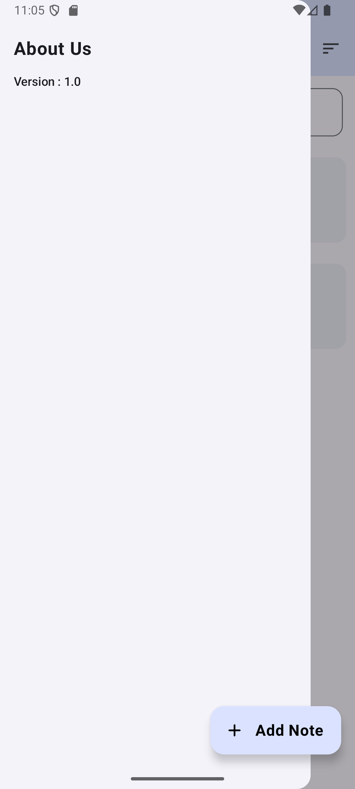
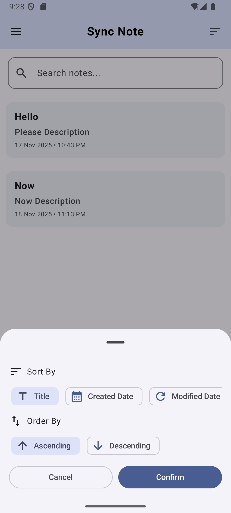
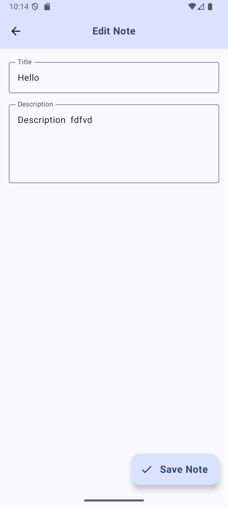
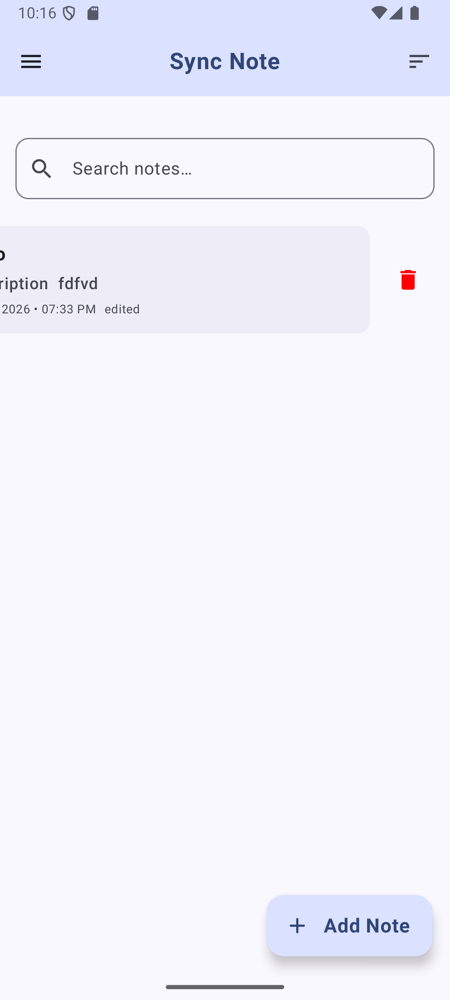

## Sync Note

Sync Note — Taking notes like a breeze.

Note management app built with Jetpack Compose and the newest modern Android Clean Architecture guide

Simple Notes is an Android application designed to create, edit, sort, and manage notes efficiently.
This project is built using:

# Overview
Simple Notes is an Android application designed to create, edit, sort, and manage notes efficiently.

Clean Architecture
Kotlin
Jetpack Compose
Room Database
Material 3 UI

This project is intended as a reference for beginners learning Clean Architecture & Compose.

 

  
  
  
  
  
  

 

🌟 Features
-Create notes
-Edit notes
-Delete notes
-Sort notes (Title, Created Date, Modified Date)
-Order (Ascending / Descending)
-BottomSheet with single-selection chips
-Local persistence using Room
-Search notes
-Modern clean UI (Material 3 + Compose)